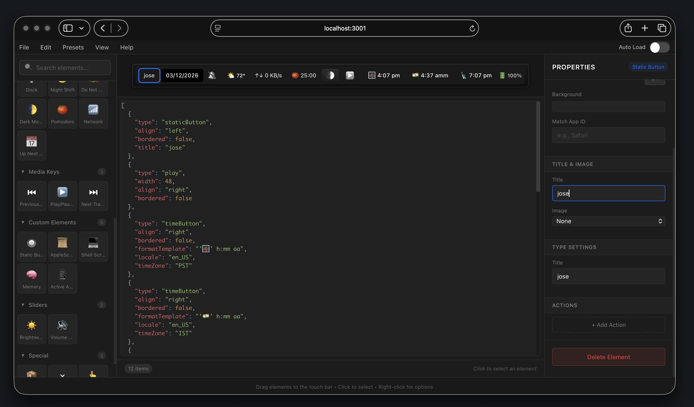

<p align="center">
  
</p>

<h1 align="center">MTMR Designer</h1>

<p align="center">
  <strong>A visual drag-and-drop designer for macOS Touch Bar presets</strong>
</p>

<p align="center">
  Build, preview, and export custom <a href="https://github.com/Toxblh/MTMR">MTMR</a> Touch Bar configurations — no JSON by hand.
</p>

<p align="center">
  <a href="https://josetwentyfour.github.io/mtmr-designer">Documentation</a> &middot;
  <a href="#quick-start">Quick Start</a> &middot;
  <a href="#features">Features</a> &middot;
  <a href="#architecture">Architecture</a>
</p>

<p align="center">
  
  
  = 18" />
  
  
</p>

---

<p align="center">
  
</p>

## Features

**Visual Editor** — See your Touch Bar layout in real-time. Drag elements from the palette, reorder with drag-and-drop, right-click for context menus.

**39 Element Types** — Buttons, media keys, native plugins (weather, CPU, battery, music, network, etc.), sliders, groups, and custom script buttons across 6 categories.

**Rich Property Editor** — Configure titles, images, colors, widths, alignment, actions, and type-specific settings for every element.

**Action System** — Assign tap actions (single, double, triple, long press) with HID keycodes, AppleScript, shell scripts, or URL triggers.

**JSON Editor** — Live syntax-highlighted JSON preview with inline editing, validation, import/export, and click-to-select sync.

**Preset System** — 5 built-in presets, 26 community presets, plus save and manage your own custom presets with overwrite support.

**MTMR Integration** — Load and save directly to your MTMR config file at `~/Library/Application Support/MTMR/items.json`.

**Undo & Redo** — Full history support with keyboard shortcuts. Your work auto-saves to localStorage.

## Quick Start

### Web App (Browser)

```bash
# Clone the repository
git clone https://github.com/josetwentyfour/mtmr-designer.git
cd mtmr-designer

# Install dependencies
pnpm install
cd server && npm install && cd ..

# Start the development server
pnpm run dev
```

Open **http://localhost:3001** in your browser.

### Native App (MTMR 2026)

The MTMR 2026 native macOS app automatically opens the Designer on launch:

```bash
# Build the web app for bundling
./build-webapp.sh

# Open in Xcode and build, or use existing build
open mtmr-src/MTMR.xcodeproj
```

The app works in two modes:
- **Bundled mode**: Uses built files from `mtmr-src/MTMR/WebApp/` (no server needed)
- **Development mode**: Falls back to `localhost:3001` if no bundled files exist

See [MTMR_DESIGNER_FIX.md](MTMR_DESIGNER_FIX.md) for details.

## Architecture

```
mtmr-designer/
├── src/                          # React frontend
│   ├── components/
│   │   ├── TouchBar/             # Visual Touch Bar canvas
│   │   ├── Palette/              # Element type catalog (left sidebar)
│   │   ├── Properties/           # Property editors (right sidebar)
│   │   └── JsonOutput/           # JSON preview/editor panel
│   ├── context/AppContext.jsx    # Global state (useReducer + localStorage)
│   ├── data/
│   │   ├── elementDefinitions.js # 39 element types, categories, defaults
│   │   └── presets.js            # Built-in + community preset configs
│   └── utils/
│       ├── jsonGenerator.js      # JSON serialization / parsing
│       └── mtmrFileSystem.js     # Server API wrappers
├── server/server.js              # Express + Vite backend
├── mtmr-src/                     # MTMR 2026 Swift app (Xcode)
└── public/presets/                # 26 community preset JSON files
```

### Frontend

**React 19 + Vite.** Three-panel layout: element palette (left), Touch Bar canvas + JSON editor (center), property editor (right, shown on selection). State managed with `useReducer` in a single context, auto-persisted to `localStorage`. Drag-and-drop powered by `@dnd-kit`.

### Backend

**Express** integrated with Vite via `vite-express`. Exposes API routes for filesystem operations:

| Endpoint | Method | Description |
|---|---|---|
| `/api/load-mtmr` | GET | Read MTMR config from disk |
| `/api/save-mtmr` | POST | Write MTMR config to disk |
| `/api/config-path` | GET | Get config file path |
| `/api/health` | GET | Server health check |

Uses `comment-json` to parse MTMR configs that contain JavaScript-style comments.

### MTMR 2026 (Optional)

Bundled fork of the MTMR Swift macOS app. Build with Xcode from `mtmr-src/MTMR.xcodeproj`. Bundle ID: `com.mtmr-designer.mtmr2026`.

## Supported Elements

| Category | Elements |
|---|---|
| **Buttons** | `escape` `exitTouchbar` `brightnessUp` `brightnessDown` `illuminationUp` `illuminationDown` `volumeUp` `volumeDown` `mute` |
| **Native Plugins** | `timeButton` `battery` `cpu` `currency` `weather` `yandexWeather` `inputsource` `music` `dock` `nightShift` `dnd` `darkMode` `pomodoro` `network` `upnext` |
| **Media Keys** | `previous` `play` `next` |
| **Custom** | `staticButton` `appleScriptTitledButton` `shellScriptTitledButton` |
| **Sliders** | `brightness` `volume` |
| **Special** | `group` `close` `swipe` |

## Preset System

| Type | Source | Save | Edit |
|---|---|---|---|
| **Built-in** | 5 curated presets | Fork to My Presets | Fork to My Presets |
| **Community** | 26 presets from contributors | Fork to My Presets | Fork to My Presets |
| **My Presets** | Your saved configurations | Overwrite in place | Direct |

- **File > Save** overwrites the active personal preset, or opens "Save as" for others
- **File > Save as Preset...** always creates a new entry in My Presets

## Adding a New Element Type

1. Add an entry to `elementTypes` in `src/data/elementDefinitions.js`
2. The Palette picks it up automatically
3. For custom property editors, add handling in `PropertiesPanel.jsx`
4. For special JSON output, update `jsonGenerator.js`

## Commands

```bash
pnpm run dev      # Development server (Express + Vite hot reload)
pnpm run build    # Production build
pnpm start        # Production server
pnpm run lint     # ESLint
```

## Tech Stack

| Layer | Technology |
|---|---|
| UI | React 19 |
| Build | Vite 7 |
| Drag & Drop | @dnd-kit |
| State | useReducer + Context |
| Syntax Highlighting | react-syntax-highlighter |
| Server | Express + vite-express |
| JSON | comment-json |
| Native App | Swift / Xcode (optional) |

## Credits

- [MTMR](https://github.com/Toxblh/MTMR) by [Anton Palgunov](https://github.com/Toxblh)
- Community preset contributors from the [MTMR-presets](https://github.com/Toxblh/MTMR-presets) repository

## License

MIT
